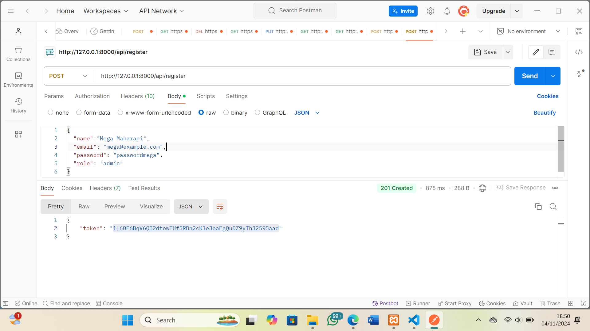
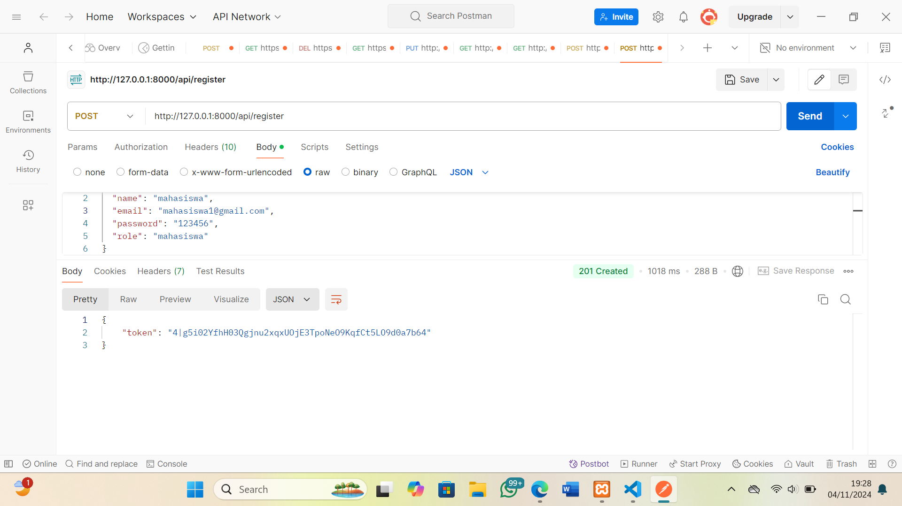
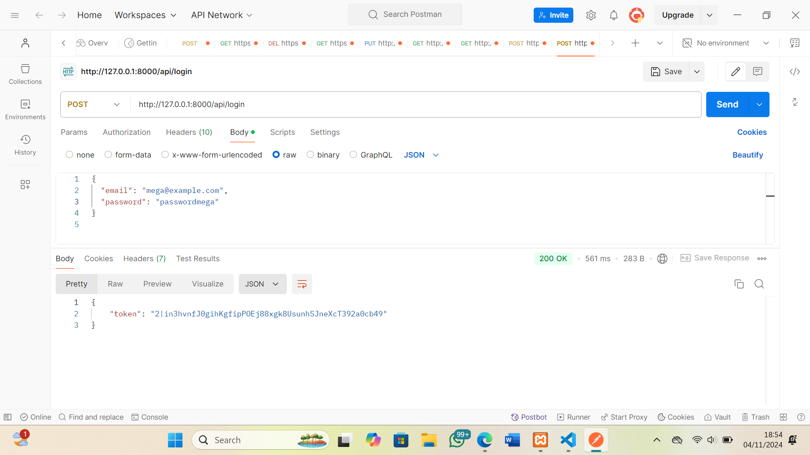
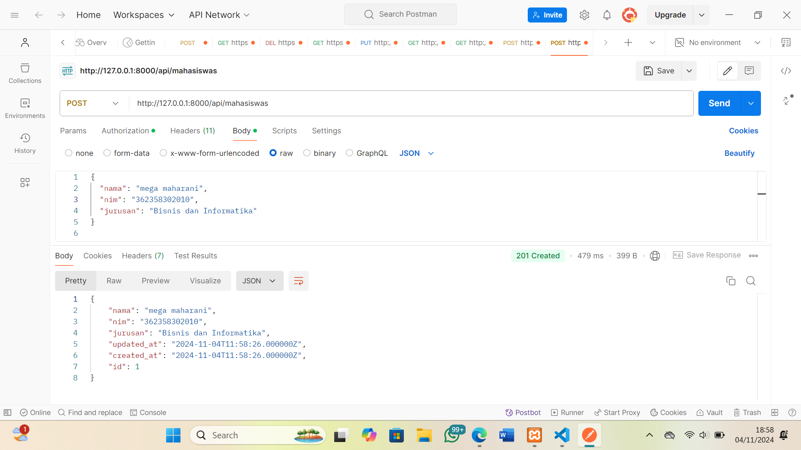
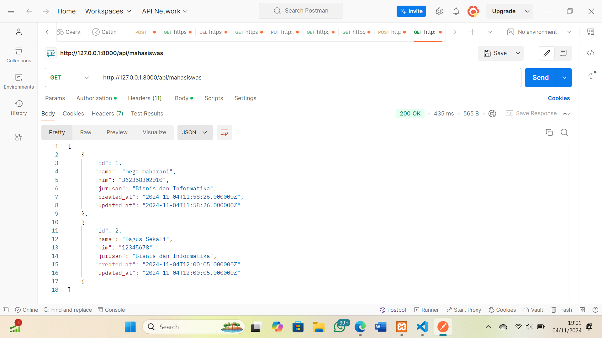
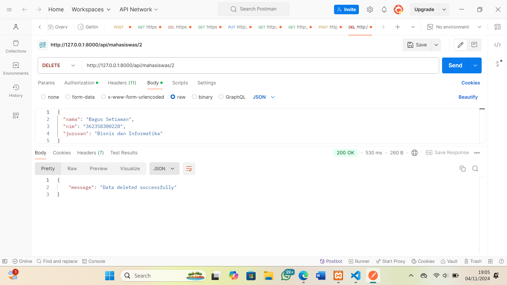
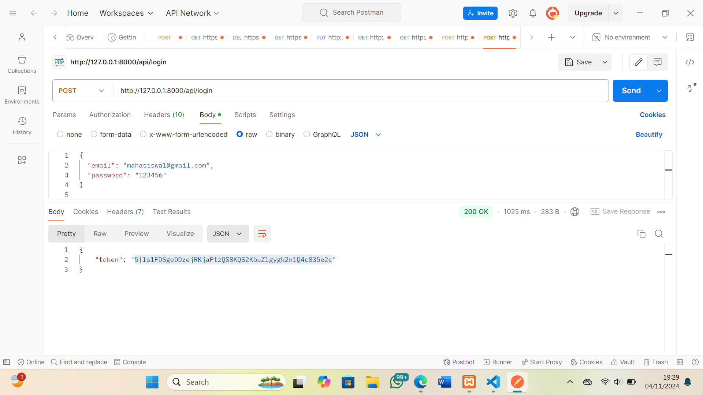
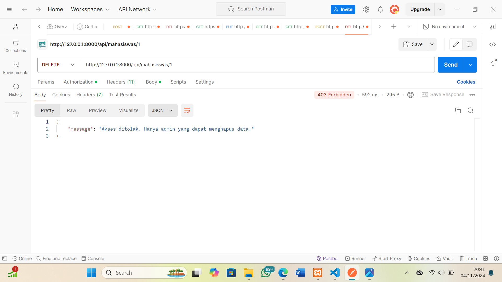

Praktikum:
Uji coba api dengan Postman:
1.Register User, dengan menggunakan method post

2.Login User, dengan menggunakan method post

3.Menyimpan data mahasiswa, dengan menggunakan method post.

4.Mengambil semua data mahasiswa, dengan menggunakan get.

5.Menghapus data mahasiswa, dengan menggunakan method delete berdasarkan id

Tugas:
A.Register
1.Register sebagai admin

2.Register sebagai mahasiswa

B.Login
1.Login sebagai Admin

admin bisa melalukan post, get, put dan delete

hanya admin yang dapat melakukan method delete

2.Login sebagai Mahasiswa

mahasiswa hanya bisa melakukan get all data

3.Hanya admin yang dapat melakukan delete
