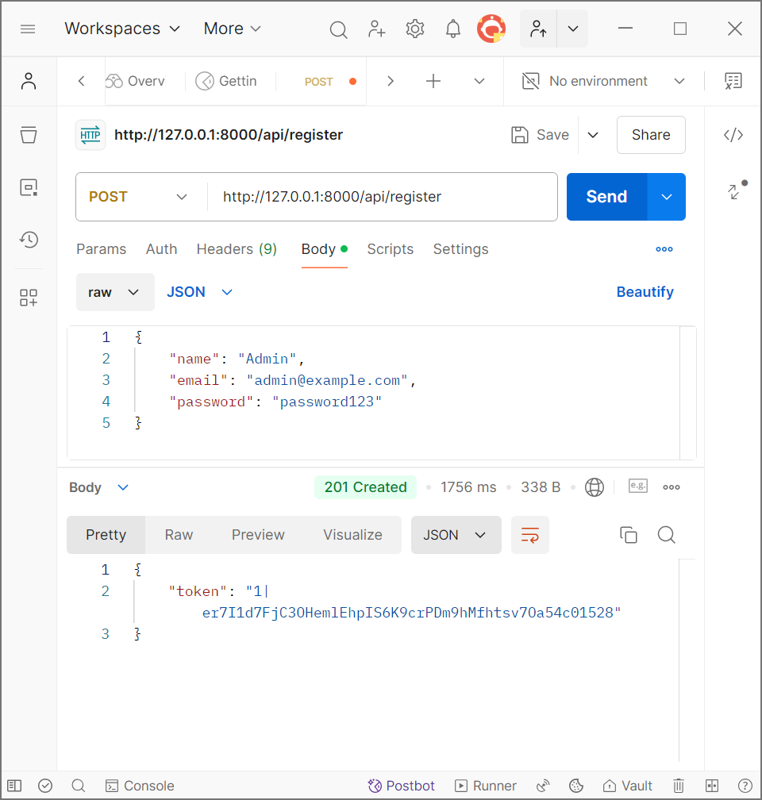
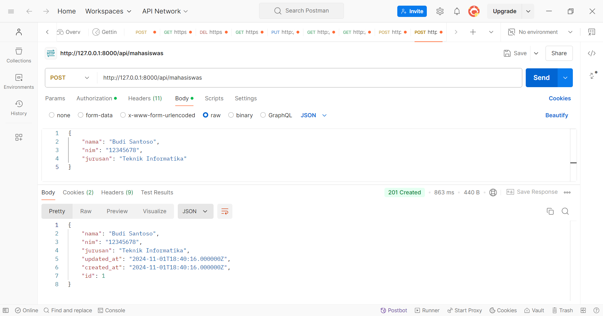
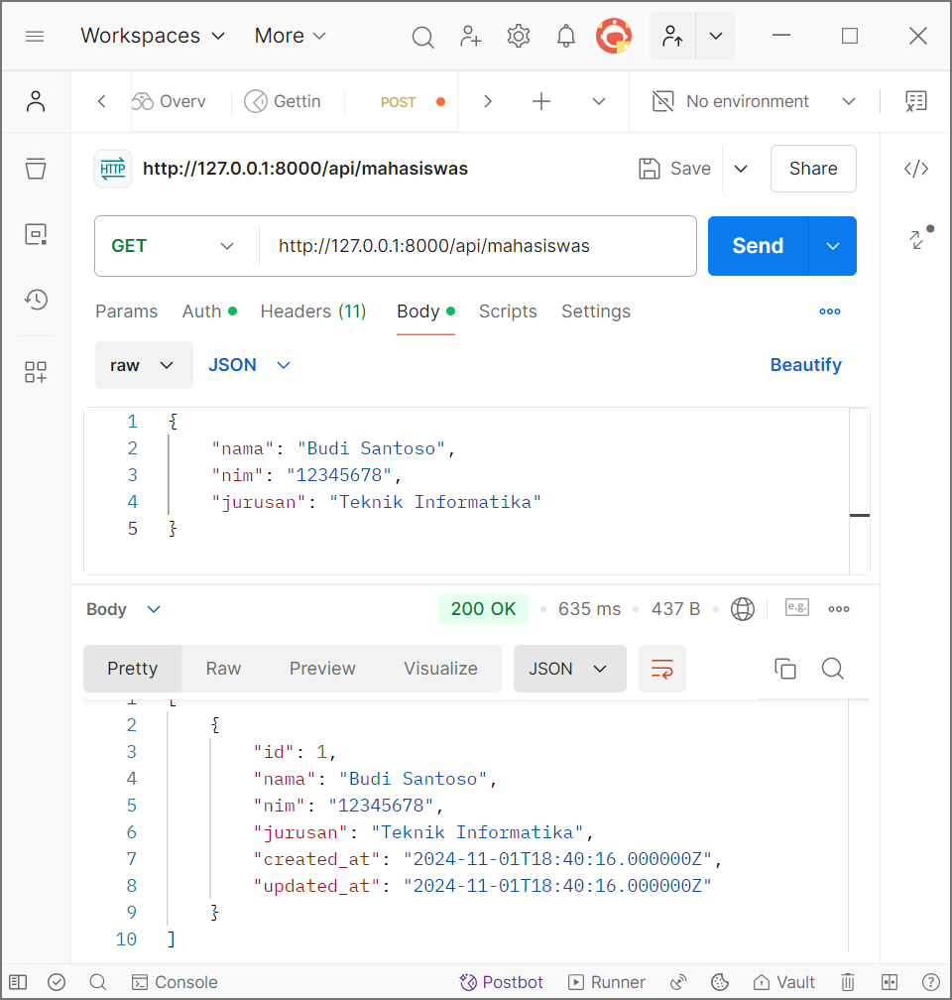
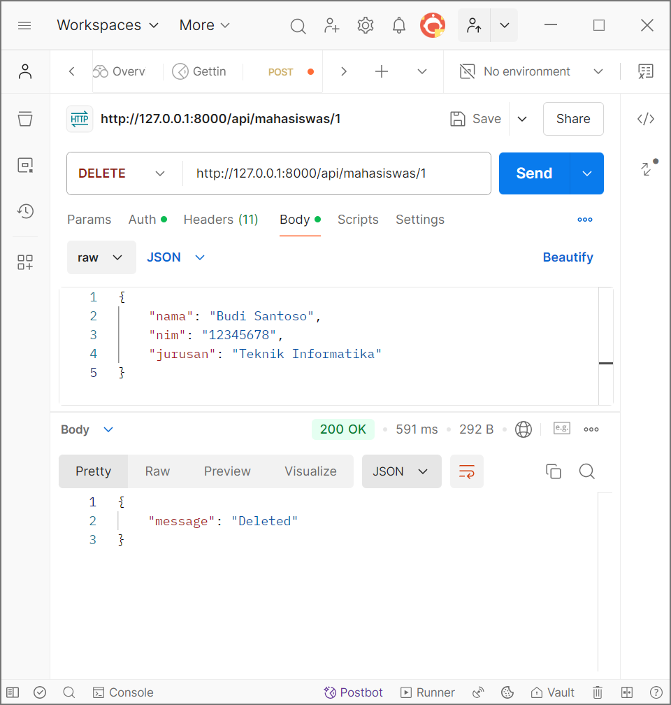

Uji coba api dengan Postman:
1.Register User, dengan menggunakan method post

2.Login User, dengan menggunakan method post

3.Menyimpan data mahasiswa, dengan menggunakan method post.

4.Mengambil semua data mahasiswa, dengan menggunakan get.

5.Menghapus data mahasiswa, dengan menggunakan method delete berdasarkan id

